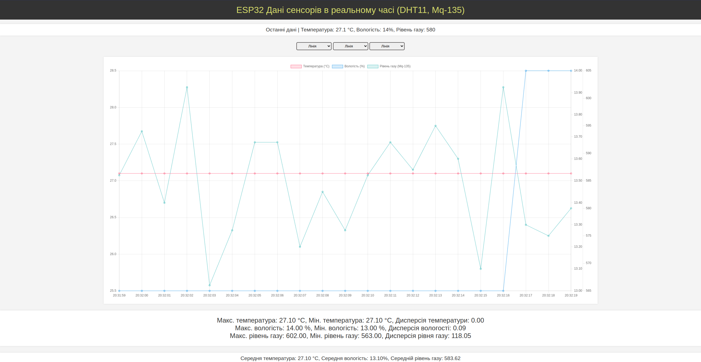

# Air Quality Monitoring System Using ESP32

This project is designed to monitor air quality using an ESP32 microcontroller with a DHT sensor and an MQ-135 gas sensor. The system measures temperature, humidity, and various gases to assess air quality. This data is sent from the ESP32 to a local web server via WebSockets, allowing real-time data monitoring through a web interface.

## Getting Started

### Prerequisites

Before you start, ensure you have the following:
- ESP32 development board
- DHT11 or DHT22 sensor
- MQ-135 gas sensor
- Arduino IDE installed on your computer
- Basic knowledge of electronics and programming microcontrollers

### Installing Dependencies

To program the ESP32, you will need to install the following libraries in the Arduino IDE:
- `WebSocketsServer` for handling WebSocket connections.
- `DHT` sensor library to interface with the DHT temperature and humidity sensor.

To install these libraries, open Arduino IDE, go to `Sketch > Include Library > Manage Libraries...`, then search for and install `WebSocketsServer` and `DHT`.

### Programming the ESP32

1. Open the `esp32.cpp` file from the repository.
2. Update the Wi-Fi SSID and password in the code to match your local network settings.
3. Upload the code to your ESP32 board via the Arduino IDE.

Make sure your ESP32 is connected to your computer, select the correct board from `Tools > Board`, and select the correct port from `Tools > Port`.

### Setting Up the Web Interface

1. Open the `Monitoring.html` file.
2. Modify the WebSocket connection IP address in the JavaScript part of the HTML file to match the IP address of your ESP32 device. This IP is printed to the Arduino IDE serial monitor when the ESP32 connects to your Wi-Fi network.
3. Open the `Monitoring.html` file in a web browser to start monitoring the air quality in real-time.

## Usage

Once everything is set up:
- The ESP32 will periodically read the air quality parameters and send the data over WebSocket to the connected web client.
- Open `Monitoring.html` in a browser to view the live data.
- The webpage will display real-time updates of temperature, humidity, and gas levels graphically and numerically.

## Contributing

Contributions are what make the open-source community such a powerful platform for learning, inspiring, and creating. Any contributions you make are **greatly appreciated**.
